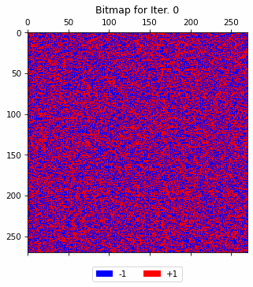

# Glauber Dynamics on Percolated Lattices

This repo holds the code for my Master Thesis on Glauber Dynamics [(Wikipedia)](https://en.wikipedia.org/wiki/Glauber_dynamics). The code for simulation is in [`python/`](python/) and. Plotting codes are in [`plotting/`](plotting/). See further down below for a description of the directory structure.

Results are in [`thesisResults/`](thesisResults/). There are three directories for the three different results we ran. For each of those three, you find `traces-all.png` which shows the development of the share of $+1$ vertices in the grid. For each experiment, we ran the simulations 10 times, and for each run you'll find a directory `/rep-k` where the details of the k-th run are stored. Also, the animations of the grids over time are visible in `animation.gif`.

For example, below is one of those animations, showing the development of repetition 1 of the experiment with a random boundary points on a square grid.



## Information on the repository
```
├── benchmarking                    # Files to measure the speed of our implementations against NumPy       
│   ├── time-matrices.py        
│   └── times-indices.py
├── plotting                        # Scritps to plot the results of the simulations
│   ├── make_gif.py
│   ├── plot_bitmaps.py
│   ├── plot_traces.py
│   └── utils.py
├── plotting-notebook.ipynb         # Notebook to produce the plots showing three bitmaps
├── pyproject.toml                  # Config file for pytest
├── python                          # Python code for the *simulations*
│   ├── continue-main.py            # Script to continue *all* runs that were interrupted
│   ├── continue_started_run.py     # Script to continue a *single* run that was interrupted
│   ├── glauber                     # All code that actually runs the simulations
│   │   ├── DataStructs
│   │   │   ├── BitArrayMat.py
│   │   │   └── ListDict.py
│   │   ├── glauberDynIndices.py    # Implementation of the glauberSimBitarray class with dynamic indexing
│   │   ├── glauberFixIndices.py    # Implementation of the glauberSimBitarray class with fixed indexing
│   │   ├── glauberSim.py           # Base class, where most of the simulation logic is
│   │   ├── glauberSimBitarray.py   # Abstract subclass of the simulation using bitarrays
│   │   └── glauberTorus.py
│   └── main.py                     # Script to start simulations - use this to run more simultations!!
├── readme.md
├── requirements_pip.txt            # Requirements for pip
├── submit-continue.sh              # Shell script to continue runs on the statistics server
├── submit-tests.sh                 # Shell script to test the code on the statistics server
├── submit-torus.sh                 # Shell script to run the torus experiment on the statistics server
├── submit.sh                       # Shell script to run the "normal" experiment on the statistics server
├── tests                           # Tests for the code - invoke with $ pytest
│   ├── test_glauber.py
│   └── test_main.py
```

## How to run new simulations

### 1. Install dependencies
You need to have Python 3.11 installed. Then, install the dependencies with
```bash
$ pip install -r requirements_pip.txt
```

### 2. Run simulations
To run simulations, use the script `python/main.py`. It takes the following arguments:
```
--t T                       Number of iterations
--p P                       Probability of +1 at initialization
--n N                       Number of repetitions (how many times we run each)
--checkpoint                Number of steps between checkpoint saves
--n_interior                Size of the interior of the lattice
--padding                   Size of the padding around the lattice
--force_new                 Can surpress checkpoint loading
--tol                       Tolerance to determine fixation
--dynamic                   if set, use dynamic indices
--mixed                     if set, use first fixed and then dynamci indices
--fixed_steps               if mixed is set, how many steps to run fixed indices for
--random_boundary           if set, will set boundary to random values
--torus                     if set, use a torus and not a square
```

Here are some example calls:

Simulate $100'000$ steps on a $100\times100$ torus with a random boundary and dynamic indexing. Save checkpoints every $1000$ steps. Run $10$ repetitions, initialize with $p=0.505$ and tolerance $0.95$.

```bash
$ python3 python/main.py --t 100000 --p 0.505 --n 10 --checkpoint 1000 --n_interior 100 --padding 0 --tol 0.95 --dynamic --random_boundary --torus
```

Simulate $100'000$ steps on a $100\times100$ square with a fixed boundary, 10 padding on each side, and mixed indexing. Use $10'000$ fixed index steps and then switch to dynamic indexing. Save checkpoints every $1000$ steps. Run $10$ repetitions, initialize with $p=0.505$ and tolerance $0.95$.

```bash
$ python3 python/main.py --t 100000 --p 0.505 --n 10 --checkpoint 1000 --n_interior 100 --padding 10 --tol 0.95 --mixed --fixed_steps 10000
```

## How to develop

If you want to make changes to the code, I recommend you use the tests in `tests/` to make sure the code still works. You can run them on the terminal with
```bash
$ pytest
```
Note that some tests take more than 5 minutes or so. In order to exclude them, use
```bash
$ pytest -k "not slow"
```