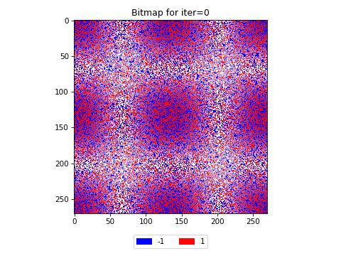

# Glauber Dynamics on Percolated Lattices

This repo holds the code for my Master Thesis on Glauber Dynamics [(Wikipedia)](https://en.wikipedia.org/wiki/Glauber_dynamics). The code for simulation is in [`python/`](python/) and `/c++`. Plotting codes are in [`plotting/`](plotting/). 

Results are in [`thesis_results/`](msc-thesis/tree/main/thesis_results/). There are three directories for the three different results we ran. For each of those three, you find `traces-all.png` which shows the development of the share of $+1$ vertices in the grid. For each experiment, we ran the simulations 10 times, and for each run you'll find a directory `/rep-k` where the details of the k-th run are stored. Also, the animations of the grids over time are visible in `animation.gif`.

For example, below is one of those animations, showing the development of repetition 1 of the experiment with a random boundary points on a square grid.

## Information on the repository
.
├── benchmarking                    # Files to measure the speed of our implementations against NumPy       
│   ├── time-matrices.py        
│   └── times-indices.py
├── plotting                        # Scritps to *plot* the results of the simulations
│   ├── make_gif.py
│   ├── plot_bitmaps.py
│   ├── plot_traces.py
│   └── utils.py
├── plotting-notebook.ipynb         # Notebook to produce the plots showing three bitmaps
├── pyproject.toml                  # Config file for `pytest``
├── python                          # Python code for the *simulations*
│   ├── continue-main.py            # Script to continue *all* runs that were interrupted
│   ├── continue_started_run.py     # Script to continue a *single* run that was interrupted
│   ├── glauber                     # All code that actually runs the simulations
│   │   ├── DataStructs
│   │   │   ├── BitArrayMat.py
│   │   │   └── ListDict.py
│   │   ├── glauberDynIndices.py    # Implementation of the glauberSimBitarray class with dynamic indexing
│   │   ├── glauberFixIndices.py    # Implementation of the glauberSimBitarray class with fixed indexing
│   │   ├── glauberSim.py           # Base class, where most of the simulation logic is
│   │   ├── glauberSimBitarray.py   # Abstract subclass of the simulation using bitarrays
│   │   └── glauberTorus.py
│   └── main.py                     # Script to start simulations
├── readme.md
├── requirements_pip.txt            # Requi1rements for pip
├── submit-continue.sh              # Shell script to continue runs on the statistics server
├── submit-tests.sh                 # Shell script to test the code on the statistics server
├── submit-torus.sh                 # Shell script to run the torus experiment on the statistics server
├── submit.sh                       # Shell script to run the "normal" experiment on the statistics server
├── tests                           # Tests for the code - invoke with `$ pytest`
│   ├── test_glauber.py
│   └── test_main.py
